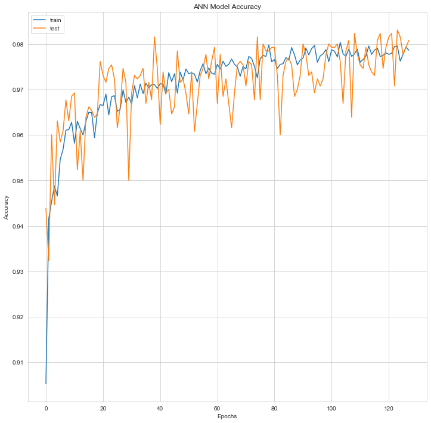

# Predicting Object Class (Galaxy, Star or Quasar) with Aritificial Neural Network and XGBoost

## Problem Statement

The class identifies an object to be either a galaxy, star or quasar. This will be the response variable which we will be trying to predict. The purpose of this study is to predict whether the **class** is **GALAXY**, **STAR** or **QUASAR** based on the available dataset. 

## Dataset

Datasets are downloaded from [Kaggle user Lennart Grosser](https://www.kaggle.com/lucidlenn/sloan-digital-sky-survey). You can find the details of the datasets Kaggle. **Skyserver_SQL2_27_2018 6_51_39 PM.csv** dataset has ***18*** columns and ***10001*** rows with the header.

## Methodology

In this project, as stated in the title, results were obtained through **XGBoost** and **artificial neural networks (ANN)** methods. 

## Analysis

 | # | Column | Non-Null Count | Dtype |
|--|--|--|--|
| 0 | objid | 10000 non-null | float64
| 1 | ra | 10000 non-null | float64
| 2 | dec | 10000 non-null | float64
| 3 | u | 10000 non-null | float64
| 4 | g | 10000 non-null | float64
| 5 | r | 10000 non-null | float64
| 6 | i | 10000 non-null | float64
| 7 | z | 10000 non-null | float64
| 8 | run | 10000 non-null | int64
| 9 | rerun | 10000 non-null | int64
| 10 | camcol | 10000 non-null | int64
| 11 | field | 10000 non-null | int64
| 12 | specobjid | 10000 non-null | float64
| 13 | class | 10000 non-null | object
| 14 | redshift | 10000 non-null | float64
| 15 | plate | 10000 non-null | int64
| 16 | mjd | 10000 non-null | int64
| 17 | fiberid | 10000 non-null | int64

dtypes: **float64(10), int64(7), object(1)**

What the dependent and independent variables mean is specified by [Kaggle user Lennart Grosser](https://www.kaggle.com/lucidlenn/sloan-digital-sky-survey).
  
| Layer (type) | Output Shape | Param # |
|--|--|--|
| dense_5 (Dense) | (None, 32) | 512 |
| dense_6 (Dense) | (None, 16) | 528 |
| dense_7 (Dense) | (None, 32) | 544 |
| dense_8 (Dense) | (None, 3) | 99 |

Total params: 1,683
Trainable params: 1,683
Non-trainable params: 0

**Number of NaN:**

> **Number of NaN values:**   0 

 **Number of Duplicated Rows:**

> **0 duplicated rows.**

The estimated data was made on the first row in the data set. Actual result is **STAR**. Class of the star coincide as **[2]**. 

### XGBoost

1st column = GALAXY accuracy
2nd column = QUASAR accuracy
3rd column = STAR accuracy

**Prediction of XGBoost:**
Model output: [[**0.27175558 0.26087973 0.46736473**]].

> **Accuracy score(XGBoost): 0.9939393939393939**

### Artificial Neural Network

**Prediction of ANNs:**
Model predicted as STAR
Model predicted class as [2].

> **val_accuracy: 0.9800**

**Process took 1.607076644897461 seconds.**

In ***Plot*** folder, you can find ***model_val_accuracy.png***  which is showing plot of test and train accuracy with val_accuracy. Accuracy values and also plot can change a bit after you run the algorithm.

## How to Run Code

Before running the code make sure that you have these libraries:

 - pandas 
 - time
 - sklearn
 - seaborn
 - numpy
 - warnings
 - xgboost
 - matplotlib
 - keras
    
## Contact Me

If you have something to say to me please contact me: 

 - Twitter: [Doguilmak](https://twitter.com/Doguilmak).  
 - Mail address: doguilmak@gmail.com
 